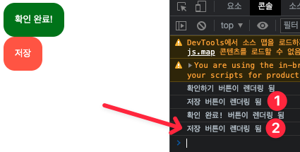
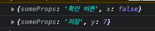
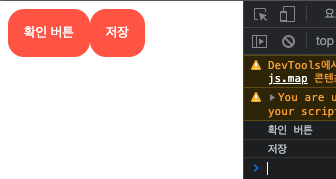
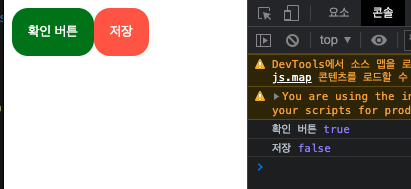

컴포넌트의 매개변수로 props를 주면, 아래와 같이 컴포넌트에 사용 가능하다는 것이다.



주의할점은 컴포넌트의 매개변수는 반드시 하나만 사용 가능하다는 것이다. 하지만 이 매개변수를 Object로
만들면 여러개의 props를 받을 수 있다.

여기서 props는 object이므로 컴포넌트의 값을 주고 싶다면 x={false}와 같이 사용 가능하다.



```javascript
const Btn = ({ someProps }) => {
    return <button>{someProps}</button>;
};

function App() {
    return (
        <div>
            <Btn someProps="확인 버튼" x={false} /> //해당 컴포넌트의 프로퍼티이름은 마음대로 정해줄
            수 있다.
            <Btn someProps="저장" y={7} />
        </div>
    );
}
```



여러개의 props를 만들어 넣어주면 삼항연산자등을 통해 아래와 같이 구문을 작성할 수 있다.

```javascript
const Btn = ({ someProps, istrue }) => {
    return (
        <button
            style={{
                backgroundColor: istrue ? 'green' : 'tomato',
            }}
        >
            {someProps}
        </button>
    );
};

function App() {
    return (
        <div>
            <Btn someProps="확인 버튼" istrue={true} />
            {/*해당 컴포넌트의 프로퍼티이름은 마음대로 정해줄수 있다.*/}
            <Btn someProps="저장" istrue={false} />
        </div>
    );
}
```


